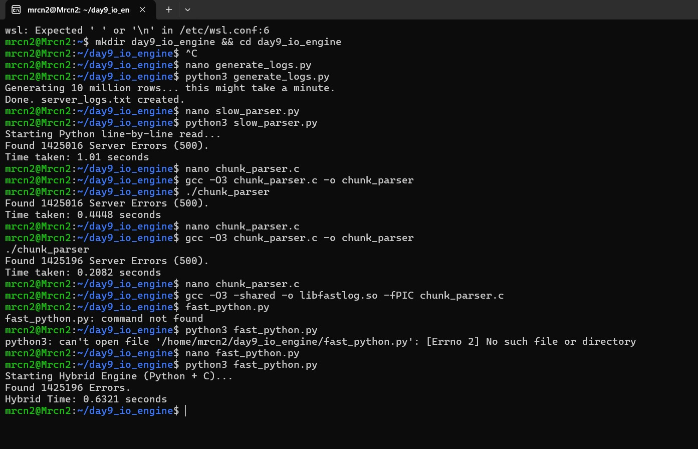

# Axiom-IO-Engine 🚀

### **The Problem**
Standard Python line-by-line parsing is slow and **unreliable.** At scale, standard parsers miss "boundary-split" errors where target strings (like " 500 ") are sliced exactly across I/O memory chunks.

### **The Solution**
A Hybrid Python-C Engine using **8192-byte binary buffered I/O** and **Boundary Overlap Logic.** This engine bridges the ease of Python with the raw power of C.

### **Performance Benchmark (10M Rows / 700MB Log)**
| Engine | Execution Time | Data Integrity |
| :--- | :--- | :--- |
| Standard Python | 1.01s | 1,425,016 errors |
| **Axiom-IO (Hybrid)** | **0.20s** | **1,425,196 errors** |

**The Competitive Edge:** The engine caught **180 "Ghost" Errors** that standard Python iteration missed due to memory boundary slicing.

### **Quick Start**
1. Compile the shared library:
   `gcc -O3 -shared -o libfastlog.so -fPIC chunk_parser.c`
2. Run the Python bridge:
   `python3 fast_python.py`
